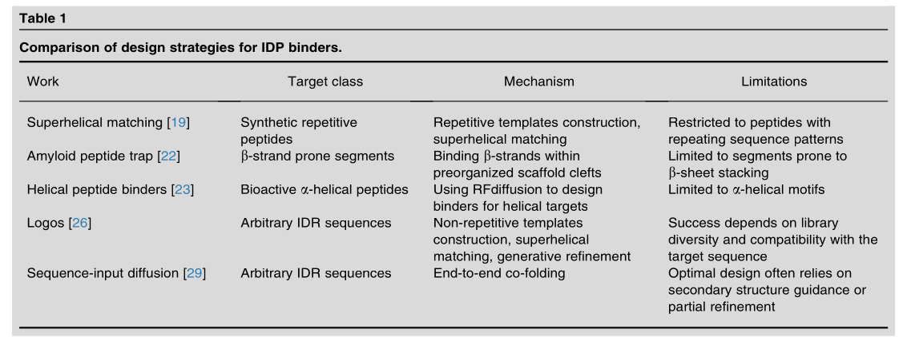

`# Project plan for IDP binder design

## Current state of IDP binder design

The latest SOTA does this:

- RFDiffusion trained on masked heterocomplexes (2 different chains - one for "target", one for "binder"). 
    - A mask is applied to the target's residues of the interface.
    - Around 50% of the residues are noised.
    - Model predicts the clean binder residues' coords ($x_0^b$) and 50% of the target's residues coords ($x_0^t$), using noised coords $x_t^b, \, x_t^t$, time step $t$ and the target sequence $s$.
    - The model is trained only on the backbone residues.
- Inference:
    - They generate around 10K-50K designs during inference, 
    - Inverse fold them with ProteinMPNN, 
    - Filter with AF2 pLDDT, etc. to get the initial "hits"
    - Noise and denoise the target-binder complex again, but use a smaller amount of noising steps. This is done to refine the prediction
    - Filter with ProteinMPNN + AF2 again

## Diffraction data and its use for IDPs

The diffraction data has implicit information about the rotamer states of a protein, possibly about different conformations of a protein, water molecules, as well as some statistically significant information about flexible regions of IDRs, which is hard to interpret visually.

The goal is to use that information alongside the sequence and structure information to train a binder generative model for IDPs/IDRs. The main idea is the following - **ensemble modelling improves co-folding**. Benefits:

- Possiblity to implicitly model altlocs (alternative locations) in PDB -> have more data to train on -> better co-folding models.
- Modelling side-chain wiggles explicitly allows to "tune" for specificity, which is associated with hydrogen bonds formed between target side-chains and binder side-chains, target side-chains and binder backbone, binder side-chains and target backbone. Additionally desolvation penalty can be modelled with $\Delta SASA$ (solvent accessible surface area) computed over several rotamers, which is substantially more robust than when it's computed for a single conformation. 
- Diffraction data might have useful signal for identifying IDR conformations -> it's an additional conditioning signal during training.
- If we can model water molecules explicitly, this would give access to desolvation as well. 

### PoC 

- Train a 3D CNN in the voxelised reciprocal space to predict CATH C-level domain label.
- The aim is too see if we can learn a signal from the raw data

### Directions and ideas for the next steps

#### 1 - Representation learning

- Run a JEPA-style SSL on voxelised sparse diffraction data in the reciprocal space. That could be a strong feature encoder for the downstream tasks.
- Generate a dataset of altlocs, using [Phenix](https://phenix-online.org/documentation/reference/ensemble_refinement.html). 10-50K monomers?

**Downstream tasks**

    1. Training a compact protein model on multiple conformers, using the reflections JEPA representations. (**assumption: Phenix gives us meaningful conformers**)

        - Generate a dataset of altlocs, using [Phenix](https://phenix-online.org/documentation/reference/ensemble_refinement.html). 10-50K monomers?
        - Mimic Complexa's architecture and train a folding model that would use JEPA's embeddings as input and attention bias.
            - Use an already pretrained VAE for all-atom reconstruction.
            - Only train a compact FlowMatching-based trunk to predict C-alphas and the latents from sequence and reflection data alone.
        
    2.  Finetuning Complexa adding JEPA embeddings.

        - Use LoRA with Complexa, but bias LoRA matrices with the JEPA embeddings. 
        - Finetune on a simple folding task - sequence + reflections to conformers. (It might be not trivial!)

#### 2 - Neural Fields and weight symmetries

    - Use nueral fields instead of voxels. 
    - Conformer generation utilising weight symmetries of neural fields??? 
    - Can we do JEPA on weights??? Need more reading!

#### 3 - Reciprocal space perturbations for conformer generation

    - To be discussed with Hamlet to get more details

#### 4 - Diffuse scattering path

    - Talk to Alex and check the data (an LLM says there are around 5M raw images online where we could search for diffuse scattering patterns)
    - Can open up a possibility to capture disorder in more details.

### Towards the end goal

#### 1 - FM with reflections

    - Adding a reflection flow into the gen pipeline, so we could actually use it to generate conformers.